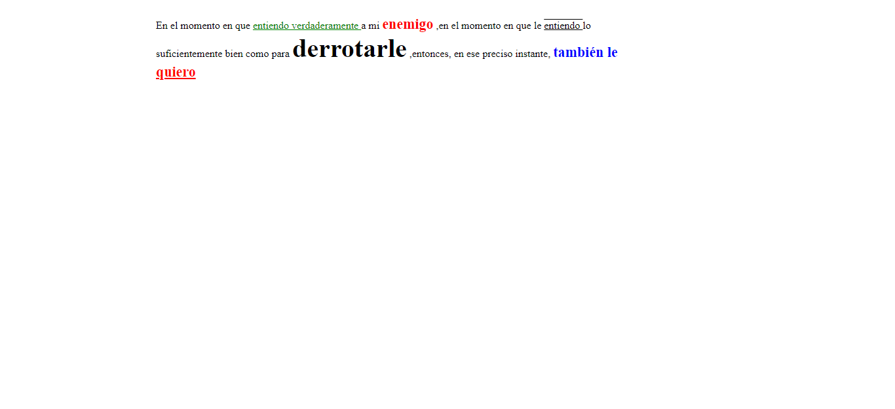
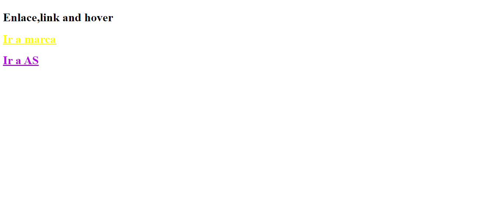
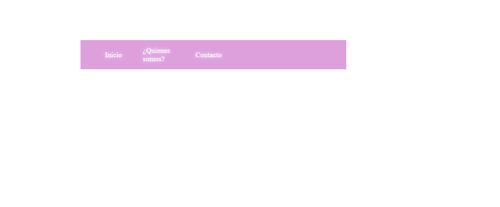
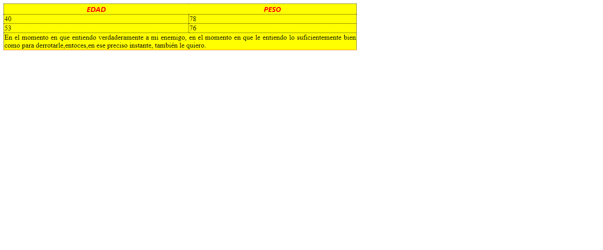
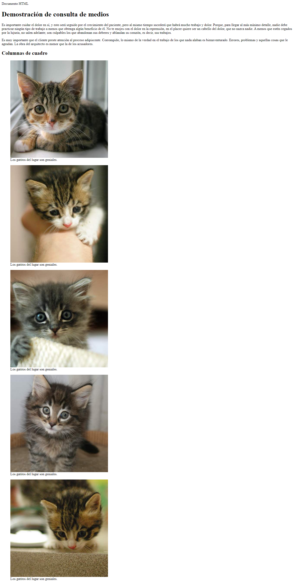

<h1> Taller Full Stack Intermedio Unidad# 9</h1>
<h1> Yener Jose Cassiani Julio</h1>
<h2>Información</h2>

Curso: Full Starck Intermedio

<h2> Punto 1: Link de Figma</h2>
<a href ="https://www.figma.com/file/7Cx8VwOWd0axpmLWhKhc2N/Yener-Jose-Cassiani-%2FWireFrames?type=design&node-id=110-64&mode=design&t=xsBWMwEzjeIWIOJy-0">Link de Figma</a>

<h2>Punto 2: HTML</h2>

<h2>Punto 3: CSS</h2>

<h2>Punto 4: CSS</h2>

<h2>Punto 5: CSS</h2>

<h2>Punto 6: CSS</h2>

<h2>Punto 7-8: CSS</h2>

<h2>Punto 9: CSS</h2>

<h2>Punto 10: CSS</h2>

